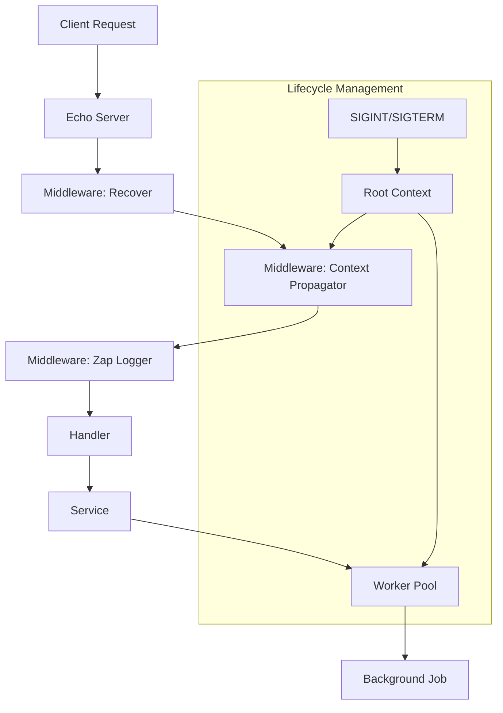
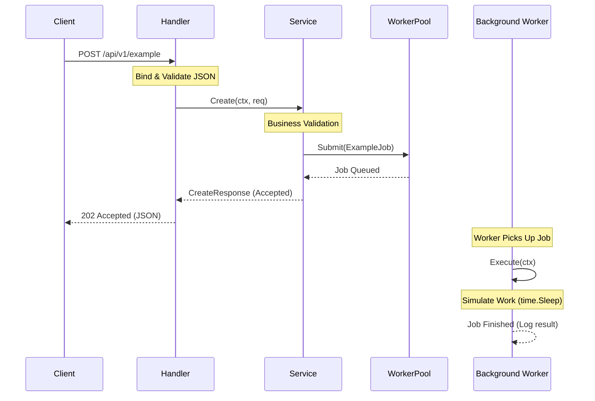

# Core REST API Architecture: Context-First Reference Implementation

This document describes the architectural patterns and design principles implemented in this project, which serves as a production-grade template for high-scale Go systems.

## 1. Core Principles

### 1.1 Context-First Lifecycle
Every component in the system respects `context.Context`. The application lifecycle is governed by a single Root Context created from OS signals (`SIGINT`, `SIGTERM`).
- **Inversion of Control**: Components don't decide when to stop; they listen to the context provided by their parent.
- **Responsiveness**: Long-running operations (HTTP handlers, background jobs) are designed to abort immediately when the context is cancelled.

### 1.2 Graceful Shutdown
The system implements an ordered shutdown sequence to ensure zero request loss and data integrity:
1.  **Stop Ingress**: The HTTP server stops accepting new connections first.
2.  **Drain Workers**: Background worker pools are signaled to stop.
3.  **Resource Cleanup**: Final sync of logs and closing of any lingering resources.

### 1.3 Structured Observability
Logging is treated as a first-class citizen using **Uber's Zap**:
- **Correlation**: Every request is assigned a unique `X-Request-ID` which is propagated through the context.
- **Machine-Readable**: JSON format is used in production for easy ingestion by ELK/Loki stacks.
- **Performance**: Zero-allocation logging in hot paths using the strongly-typed Zap API.

---

## 2. Layers & Components

### 2.1 CLI & Configuration (`cmd/`, `pkg/cmd/`, `pkg/config/`)
- **Cobra**: Handles command-line arguments and flags.
- **Viper**: Manages hierarchical configuration (Defaults -> YAML -> Environment Variables).
- **Singleton Config**: Configuration is loaded once into a thread-safe singleton.

### 2.2 Server Engine (`pkg/server/`)
The `Server` struct is the orchestrator. It:
- Initializes the **Echo** web framework.
- Configures the middleware stack in the correct order.
- Manages the `signal.NotifyContext` blocking loop.

### 2.3 Middleware Stack (`pkg/middleware/`)
Execution order is enforced for safety and tracing:
1.  **Recover**: Prevents server crashes on panics.
2.  **Context Propagator**: **(Custom)** Merges Server Root Context + Request Context.
3.  **Zap Logger**: **(Custom)** Logs request entry/exit with Trace ID and latency.
4.  **CORS**: Handles cross-origin security.

### 2.4 Worker Pool (`pkg/util/worker/`)
A generic, bounded concurrency manager:
- Prevents resource exhaustion by limiting the number of concurrent goroutines.
- Uses a buffered job queue for natural backpressure.
- Fully integrated with the server's lifecycle context.

### 2.5 Domain Logic (`pkg/domain/`)
Separated into:
- **Handler**: Echo-specific logic, input binding, and validation.
- **Service**: Pure business logic, context-aware, offloads async tasks to the Worker Pool.
- **Model**: DTOs and internal state definitions.

---

## 3. Data Flow



## 4. Key Implementation Details

### Context Merging Logic
The `ContextPropagator` ensures that a handler is cancelled if the server shuts down, even if the client is still waiting.
```go
mergedCtx, cancel := context.WithCancel(rootCtx)
go func() {
    select {
    case <-requestCtx.Done(): cancel() // Client disconnect
    case <-rootCtx.Done():    cancel() // Server shutdown
    }
}()
```

### Structured Logging with Trace ID
Logs automatically include correlation IDs, making it possible to trace a single request across multiple log entries.
```json
{
  "level": "info",
  "ts": "2026-01-27T...",
  "msg": "http_request",
  "req_id": "550e8400-e29b-41d4-a716-446655440000",
  "method": "POST",
  "path": "/api/v1/example",
  "status": 202,
  "latency": "150ms"
}
```

## 5. Sample Business Process Flow

The following sequence diagram illustrates the flow of a `POST /api/v1/example` request, demonstrating the separation between synchronous API response and asynchronous background processing.


